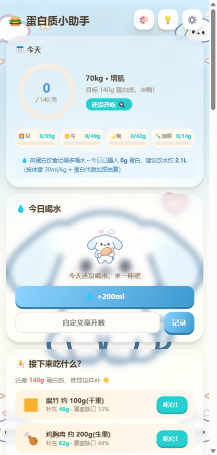
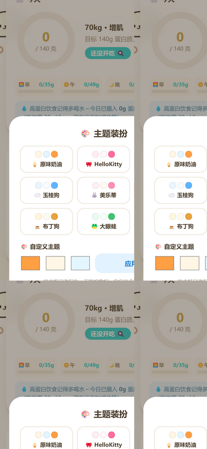
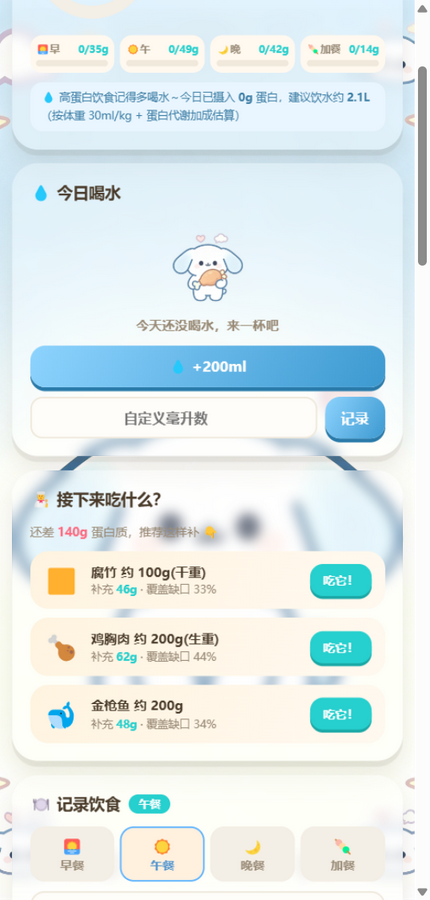

# 🍔 蛋白质小助手 Protein Buddy

> 卡通主题的健身蛋白质记录 PWA —— 按体重定制每日蛋白目标，点一点食物记录摄入，还会告诉你接下来吃什么 🐣

[🚀 立即使用（网页版）](https://ziboguo679-cloud.github.io/protein-buddy/)



## ✨ 功能

### 🥩 蛋白质追踪
- **按体重定制目标**：`每日目标 = 体重(kg) × 系数`，减脂 2.2 / 增肌 2.0 / 维持 1.4 g/kg，支持自定义系数
- **40+ 常见食物库**：肉类 / 海鲜 / 蛋奶 / 豆类 / 主食 / 蔬果 / 补剂，含生熟重量标注
- **餐次分类**：早餐 / 午餐 / 晚餐 / 加餐，分餐次进度条
- **点一点记录**：多份数快速选择（×0.5 ~ ×3），支持搜索、素食筛选、自定义食物
- **智能推荐**：根据今日缺口和已吃食物动态推荐"接下来吃什么"
- **打卡统计**：最近 7 天图表、达标率、🔥 连续达标天数、日历回看历史记录
- **一键套餐**：增肌早餐、练后加餐等模板一键加入

### 💧 喝水记录
- 快捷 ±200ml 按钮 + 自定义毫升输入
- 目标可设置（默认 1500ml），圆润进度条
- 根据蛋白摄入量给出饮水建议

### 🎨 8 套卡通主题
每套主题 = 专属背景壁纸 + 马卡龙配色 + 页面角色装饰：

奶白小猫 🎀｜浅紫小兔 🖤｜白色垂耳小狗 ☁️｜粉色小兔 🐰｜奶油小狗 🐶｜奶黄小狗 🍮｜绿色青蛙 🐸｜浅蓝海豹 🐟



毛玻璃透明卡片透出壁纸：



还支持自定义配色主题、分餐次进度、复制昨日记录、单日/餐次备注、碳水脂肪宏量统计、体重日志、数据导入导出备份、计算逻辑说明弹窗。

## 📱 安装为 App（PWA）

- **iPhone**：Safari 打开 → 分享 → 添加到主屏幕
- **安卓**：Chrome 打开 → 菜单 → 安装应用

添加后全屏运行、独立图标、断网可用（Service Worker 离线缓存）。数据保存在浏览器本地 localStorage，不上传任何服务器。

## 🛠 技术栈

纯原生 HTML / CSS / JavaScript，零框架零依赖，单页应用：

- PWA：manifest + Service Worker（stale-while-revalidate 缓存策略）
- 数据：localStorage，含 v1 → v2 数据迁移
- 移动端壁纸方案：独立 `position: fixed` 图层（规避 iOS/安卓 `background-attachment: fixed` 的模糊/跳动问题）

## 💻 本地运行

```bash
git clone https://github.com/ziboguo679-cloud/protein-buddy.git
cd protein-buddy
python server.py 8642   # 或任意静态服务器
# 浏览器打开 http://127.0.0.1:8642/
```

直接双击 `index.html` 也可以使用（离线缓存功能除外）。

## 📄 许可证

[MIT](LICENSE) — 免费使用、修改、分发，注明出处即可。

⚠️ 本工具仅供健康参考，特殊人群（肾功能障碍等）蛋白质摄入请遵医嘱。
